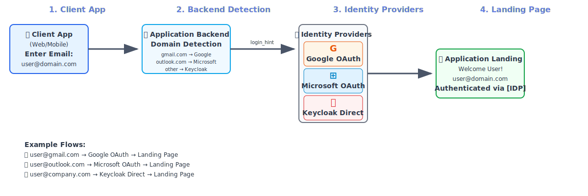

# Keycloak IDP Redirector Demo

A React application demonstrating automatic identity provider routing based on email domain using Keycloak as an identity broker.

## What This Project Demonstrates

- **Domain-based Identity Provider Routing** via Keycloak
- **OAuth 2.0 PKCE Flow** for secure single-page applications  
- **Automatic IDP Selection** based on email domain
- **Enhanced Logout** with proper session termination
- **Zero Provider Selection**: Users never choose between login buttons

## Features

- **Automatic IDP Detection**: Routes users to Google or Microsoft login based on email domain
- **Keycloak Integration**: Uses Keycloak as identity broker for seamless SSO
- **PKCE Support**: Implements PKCE (Proof Key for Code Exchange) for enhanced security
- **Backchannel Logout**: Complete session termination across all systems
- **Domain-based Routing**: 
  - Gmail addresses → Google OAuth
  - Outlook/Hotmail/Live addresses → Microsoft OAuth
  - Other addresses → Standard Keycloak login

##  Authentication Flow




## Architecture

```
User Email Input → Domain Detection → Keycloak IDP Hint → Identity Provider → Keycloak → React App
```

The application uses Keycloak as an identity broker that:
1. Receives login requests with IDP hints based on email domain
2. Redirects users to appropriate identity providers (Google/Microsoft)
3. Handles token exchange and user session management
4. Provides unified logout across all connected systems

## Prerequisites

- Node.js 16+ and npm
- Docker
- Keycloak v26+
- Google Cloud Console account (for Google OAuth)
- Microsoft Azure account (for Microsoft OAuth)

## Quick Start

### 1. Clone and Install
```bash
git clone <repository-url>
cd keycloak-idp-redirector-demo
npm install
```

### 2. Set up Environment Variables
```bash
cp .env.example .env.local
```

Edit `.env.local` with your actual credentials:
```bash
# Keycloak Configuration
REACT_APP_KEYCLOAK_URL=http://localhost:8080
REACT_APP_KEYCLOAK_REALM=idp-redirector-demo
REACT_APP_KEYCLOAK_CLIENT_ID=react-oidc-app

# Google OAuth Credentials
REACT_APP_GOOGLE_CLIENT_ID=your-google-client-id.apps.googleusercontent.com
REACT_APP_GOOGLE_CLIENT_SECRET=your-google-client-secret

# Microsoft OAuth Credentials
REACT_APP_MICROSOFT_CLIENT_ID=your-microsoft-client-id
```

### 3. Quick Setup Commands
```bash
# Complete environment setup (Docker + Keycloak + Configuration)
chmod +x scripts/keycloak-environment-setup.sh
./scripts/keycloak-environment-setup.sh

# Start React app
npm start          # Runs on http://localhost:3001
```

### What the Setup Script Does
The `keycloak-environment-setup.sh` script automatically:
- **Checks prerequisites** (Docker, curl, jq)
- **Manages Keycloak Docker container**:
  - Pulls latest Keycloak image if needed
  - Creates new container or starts existing one
  - Waits for Keycloak to be ready
- **Configures Keycloak realm**:
  - Creates `idp-redirector-demo` realm
  - Sets up OIDC client with PKCE support
  - Configures Google and Microsoft identity providers
  - Creates attribute mappers for user data
  - Creates test user: `testuser@test.com` (password: `test123`)

### Alternative Manual Setup

#### Configure Keycloak Manually
```bash
# The setup script handles both Docker installation and configuration
chmod +x scripts/keycloak-environment-setup.sh
./scripts/keycloak-environment-setup.sh
```
The Keycloak will be available at `http://localhost:8080`
The application will be available at `http://localhost:3001`

##  OAuth Provider Setup

### Google OAuth Setup
1. Go to [Google Cloud Console](https://console.cloud.google.com/)
2. Create a new project or select existing one
3. Navigate to "APIs & Services" > "Credentials"
4. Click "Create Credentials" > "OAuth 2.0 Client IDs"
5. Choose "Web application"
6. Add authorized redirect URI:
   ```
   http://localhost:8080/realms/idp-redirector-demo/broker/google/endpoint
   ```
7. Copy the Client ID and Client Secret to your `.env.local`

### Microsoft OAuth Setup
1. Go to [Azure Portal](https://portal.azure.com/)
2. Navigate to "Azure Active Directory" > "App registrations"
3. Click "New registration"
4. Set application as "Public client (mobile & desktop)"
5. Add redirect URI:
   ```
   http://localhost:8080/realms/idp-redirector-demo/broker/microsoft/endpoint
   ```
6. Under "Authentication" > "Advanced settings":
   - Set "Allow public client flows" to "Yes"
7. Copy the Application (client) ID to your `.env.local`

**Note**: Microsoft IDP is configured to use PKCE (Proof Key for Code Exchange) for enhanced security with public clients, so no client secret is required.

##  Usage

1. **Open the application**: Navigate to `http://localhost:3001`
2. **Enter email address**: Type any email address in the input field
3. **Automatic routing**: The app detects the domain and shows routing information:
   - `user@gmail.com` → "Google login"
   - `user@outlook.com` → "Microsoft login"  
   - `testuser@test.com` → "Standard Keycloak login" (password: test123)
   - `user@company.com` → "Standard Keycloak login"
4. **Click login**: The app redirects to the appropriate identity provider
5. **Complete authentication**: Login with your credentials
6. **View results**: See user information and logout options
7. **Test logout**: Click provider-specific logout button

##  Project Structure

```
keycloak-idp-redirector-demo/
├── 📂 src/
│   ├── 📂 components/
│   │   ├── 📂 __tests__/        # Component tests
│   │   ├── LoginButtons.js      # Email input with domain detection
│   │   ├── Callback.js          # OAuth callback handler
│   │   └── LogoutCallback.js    # Logout callback handler
│   ├── 📂 providers/
│   │   └── 📂 keycloak/
│   │       └── KeycloakProvider.js # Core authentication logic
│   ├── 📂 utils/
│   │   ├── 📂 __tests__/        # Utility tests
│   │   ├── logger.js            # Logging utility
│   │   └── pkce.js              # PKCE implementation
│   ├── App.js                   # Main application component
│   └── index.js                 # Application entry point
├── 📂 scripts/
│   └── keycloak-environment-setup.sh # Complete Keycloak setup script
├── 📂 public/
│   └── index.html               # HTML template
├── .env.example                 # Environment template
├── .gitignore                   # Git ignore rules
├── package.json                 # Project dependencies
├── package-lock.json            # Dependency lock file
├── CONTRIBUTING.md              # Contribution guidelines
├── LICENSE                      # MIT license
└── README.md                    # This documentation
```

##  Key Components

### Domain Detection
The application automatically detects email domains and maps them to identity providers:

```javascript
const domainMappings = {
    'gmail.com': 'google',
    'outlook.com': 'microsoft',
    'hotmail.com': 'microsoft',
    'live.com': 'microsoft',
    'msn.com': 'microsoft'
};
```

### PKCE Implementation
Implements PKCE for enhanced security:
- Generates code verifier and challenge
- Uses S256 method for code challenge
- Stores verifier securely for token exchange

### Backchannel Logout
Provides complete session termination:
- Logs out from Keycloak
- Triggers logout from identity providers
- Clears all local storage and session data

## Security Features

- ✅ **PKCE Flow**: Secure OAuth 2.0 for SPAs
- ✅ **Token Revocation**: Proper cleanup on logout
- ✅ **IDP-Aware Logout**: Terminates upstream sessions
- ✅ **Secure Storage**: Temporary PKCE storage with cleanup
- ✅ **Domain Validation**: Email format validation

## Testing

The project includes comprehensive unit tests for all core components and utilities:

### Running Tests
```bash
# Run all tests
npm test

# Run tests in watch mode (interactive)
npm test -- --watch

# Run tests with coverage
npm test -- --coverage --watchAll=false
```

### Test Coverage
- **Components**: LoginButtons, Callback, LogoutCallback
- **Utilities**: Logger, PKCE implementation
- **Authentication Flow**: Domain detection, token handling
- **Error Scenarios**: Invalid inputs, network failures

### Test Structure
```
src/
├── components/__tests__/
│   └── LoginButtons.test.js     # Component behavior tests
└── utils/__tests__/
    ├── logger.test.js           # Logging utility tests
    └── pkce.test.js             # PKCE implementation tests
```


## Troubleshooting

### Common Issues

**Keycloak not accessible**
```bash
# Check if Keycloak is running
curl http://localhost:8080/health/ready

# Restart Keycloak if needed
docker restart keycloak-idp-redirector-demo

# Or run the setup script again
./scripts/keycloak-environment-setup.sh
```

**OAuth redirect URI mismatch**
- Verify redirect URIs in Google/Microsoft console match exactly
- Check for trailing slashes or protocol mismatches

**CORS errors during logout**
- This is expected behavior for cross-origin logout requests
- The application handles these gracefully

**Port conflicts**
- Keycloak runs on port 8080
- React app runs on port 3001
- Ensure these ports are available

### Debug Mode
Enable detailed logging by opening browser developer tools and checking the Console tab during authentication flows.

## Perfect For Learning

- OAuth 2.0 PKCE implementation
- Keycloak identity brokering
- React authentication patterns
- Domain-based routing logic
- Secure logout flows

## Next Steps

1. **Customize Domains**: Add your company domains to the mapping
2. **Add IDPs**: Extend with additional identity providers
3. **Enhance UI**: Improve the user interface
4. **Add Features**: Implement user profile management
5. **Deploy**: Set up production deployment

## Contributing

1. Fork the repository
2. Create a feature branch: `git checkout -b feature-name`
3. Make your changes
4. Test thoroughly
5. Submit a pull request

See [CONTRIBUTING.md](CONTRIBUTING.md) for detailed guidelines.

##  License

MIT License - see [LICENSE](LICENSE) file for details.

## Acknowledgments

- [Keycloak](https://www.keycloak.org/) for identity and access management
- [React](https://reactjs.org/) for the frontend framework
- OAuth 2.0 and OpenID Connect specifications